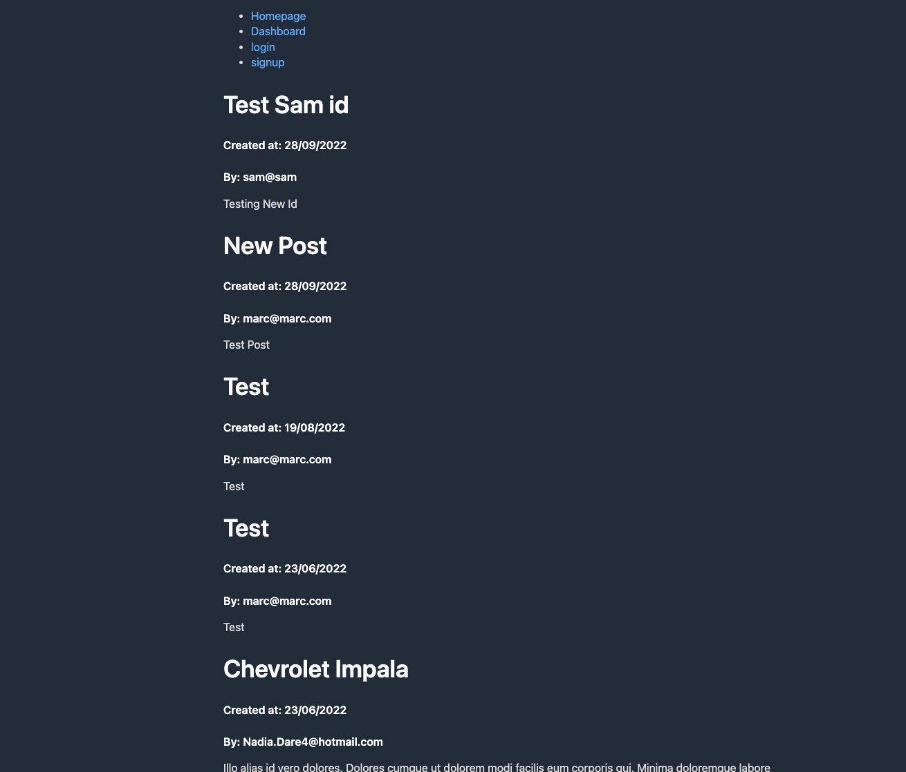

# mvc-tech-blog

## Description
This application was allows new users to sign up and existing users to sign in securely 

## Table of Contents
- [Description](#description)
- [Table of Contents](#table-of-contents)
- [Installation](#installation)
- [Usage](#usage)
- [Deployed Link](#deployed-link)
- [Screen Shots ](#screen-shot)
- [Built With](#built-with)
- [Questions](#questions)

## Installation
`git clone` the repo to your local machine. To use this application, run the following command to install the dependencies: 

     npm install

Then run the following command:

`npm seed`

## Usage
Type the following command in your termimal:

`npm run start`

Then open a browser and type http://localhost:3001/ to run this application on your local machine.

## Deployed Link

The link to the deployed application is: https://text-editor123456789.herokuapp.com/

## Screen Shots

**[⬆ back to top](#table-of-contents)**

## Built With

* [HTML](https://developer.mozilla.org/en-US/docs/Web/HTML)
* [Handlebars](https://handlebarsjs.com/)
* [Javascript](https://developer.mozilla.org/en-US/docs/Web/Javascript)
* [My SQL](https://www.mysql.com/)
  
**[⬆ back to top](#table-of-contents)**

## Questions
For any question, please contact me on GitHub: [Fishgif](https://github.com/Fishgif) 

**[⬆ back to top](#table-of-contents)**
